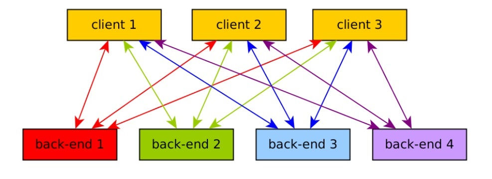
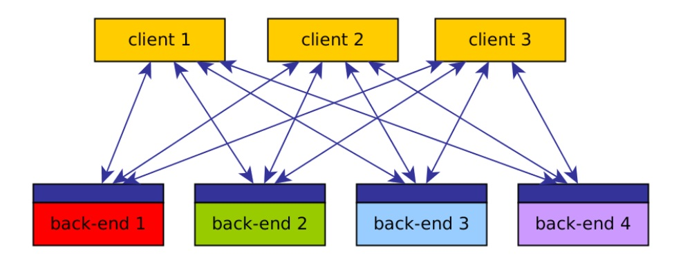
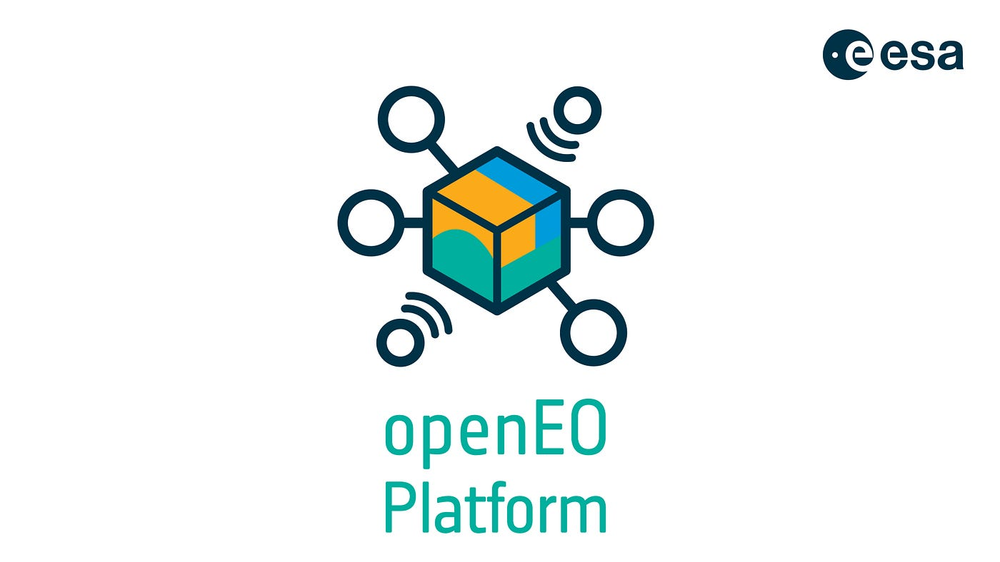

# OpenEO - Open Earth Observation 


authors: @wittrockscode, @martinkrg26
## Was ist OpenEO?  

**OpenEO** ist eine Initiative zur Vereinfachung des Zugangs und der Verarbeitung von Erdbeobachtungsdaten

### Es gibt zwei grundlegende Probleme:

* Downloadgröße von Erdbeobachtungsdaten ist viel zu groß!
* Organisation von Daten in „Tiles“ macht es unnötig kompliziert für die Analyse!

### Lösung:

1. Speichern von Daten in der Cloud
1. Im Backend berechnen und verarbeiten
1. Die Ergebnisse abrufen oder entstandene Analysen downloaden.

## Wie macht OpenEO das?

OpenEO entwickelt eine ***API***, mit der Clients (R, Python, JavaScript) Erdbeobachtungsdaten im Backend auf eine simple und einheitliche Art und Weise verbinden können.

### Funktionalität ohne API


### Mit API von OpenEO


### API
* zum Erforschen (API, EO Data, Prozesse)
* Authentifizierung (OpenID Connect)
* Nutzt Prozesse (Funktionen)
	* [vordefinierte Prozesse](https://openeo.org/documentation/1.0/processes.html)
	* vom Nutzer selbst definierte Prozesse
	* vom Nutzer selbst definierte Funktionen in R, Python oder JavaScript
* Dateimanagement
* Web Services

## Merkmale von OpenEO

* Cloudbasiert
* Open Source
* Wird von der Community geleitet
* Vereinfachte Nutzung über Data Cubes

## Zum Verständnis, OpenEO ist kein(e)...

* anderer Cloud Provider
* geoprocessing software
* traditionelles GIS

## Clients
* [JavaScript](https://openeo.org/documentation/1.0/javascript/#installation) / TypeScript 
* [Python](https://openeo.org/documentation/1.0/python/) 
* [R](https://openeo.org/documentation/1.0/r/) 
*  [QGIS](https://openeo.org/documentation/1.0/qgis/)
* Browser (Web-Editor without programming) 

## Backends
* GeoPySpark (Geotrellis)
* **Google Earth Engine**
* GRASS GIS
* JEODPP
* OpenDataCube
* Apache Airflow / eoDataReaders
* **Sentinel Hub**
* WCPS (rasdaman)
* R backend
* **OpenEO Platform**


## Andere Komponenten



### Was ist [OpenEO Platform](https://openeo.cloud/)
	
OpenEO Platform ist eine Implementierung der OpenEO-Spezifikationen. Diese Platform setzt die Prinzipien von OpenEO in die Praxis um und ist sozusagen das am naheligenste Backend für EO-Daten

* Cloud Provider
* gefördert von der ESA
* Verfügbarkeit von Erdbeobachtungsdaten
* technische Umsetzung der OpenEO-Richtlinien

### OpenEO Hub

* OpenEO Community

## Implementierung und Nutzen am Beispiel von JavaScript

Um die bereitgestellten Funktionalitäten von OpenEO zu nutzen, muss das programmiersprachenspezifische Package in das Programm eingebunden werden - in diesem Fall mit NPM.
```bash
npm install @openeo/js-client
```
Das OpenEO Object kan nun importiert werden.
```js
const { OpenEO } = require('@openeo/js-client');
```
Die **connect** funktion baut nun eine Verbindung zu einem Backend auf und gibt ein [Connection Object](https://open-eo.github.io/openeo-js-client/latest/Connection.html) zurück.
```js
const con = await OpenEO.connect("https://earthengine.openeo.org");
```
Mit diesem kann man z.B. die Metadaten des Backends abrufen:
```js
const metadata = con.capabilities();
```
Um auf die zur Verfügung gestellten Daten zuzugreifen werden sogenannte **Collections** benutzt.
```js
const collections = await con.listCollections();
```
Des Weiteren können noch **Processes** vom Backend bereitgestellt werden oder vom User kreiert werden.
```js
const processes = await con.listProcesses();
```
Mit diesen können Verschiedene [Funktionen](https://openeo.org/documentation/1.0/processes.html) auf die Daten angewedet werden.

## Ressourcen und Quellen

* https://openeo.org/about.html
* https://www.youtube.com/watch?v=tCoAedg6RWI
* [OpenEO Cookbook](https://openeo.org/documentation/1.0/cookbook/#chapter-1)
